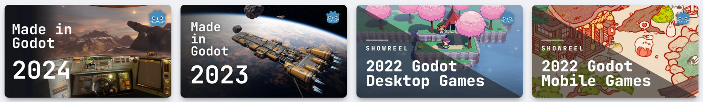
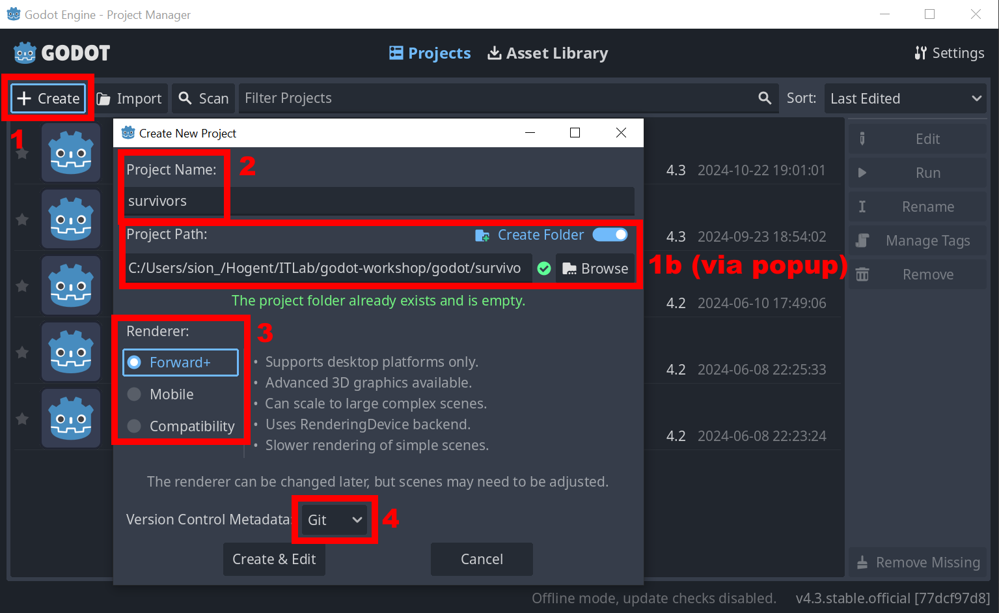
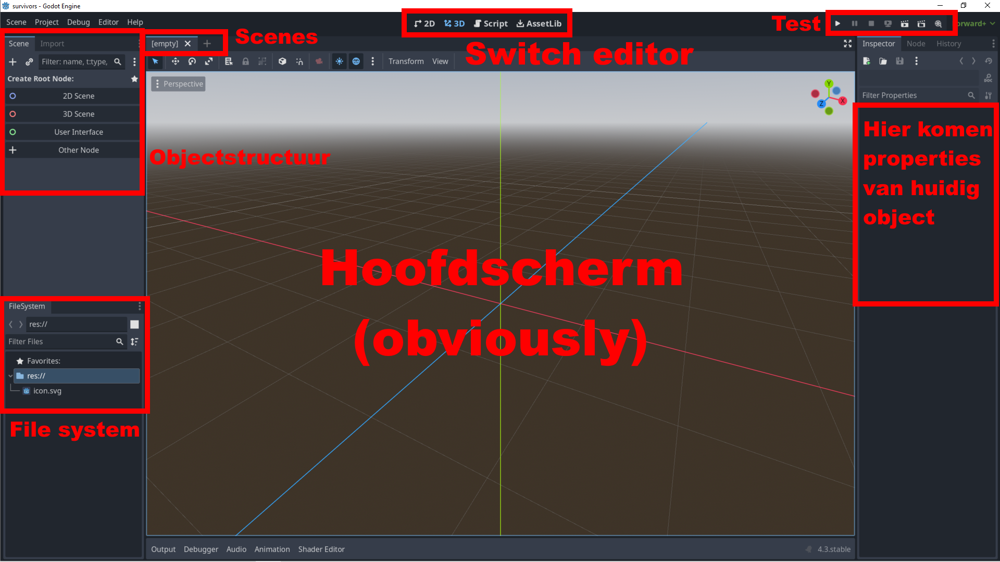
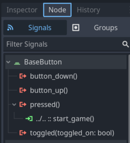
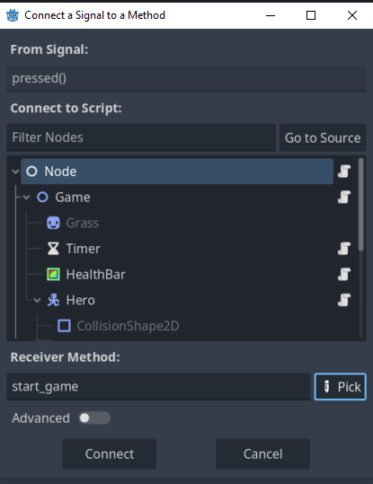
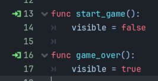
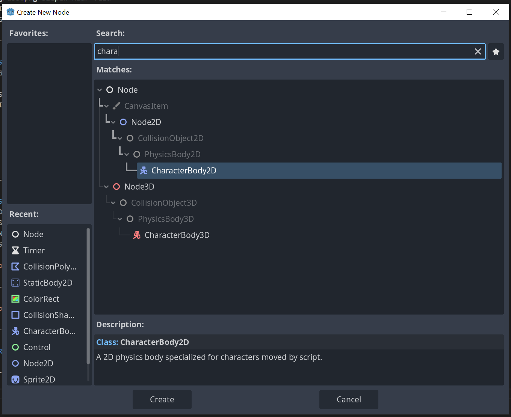
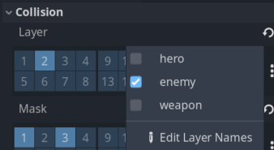
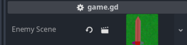
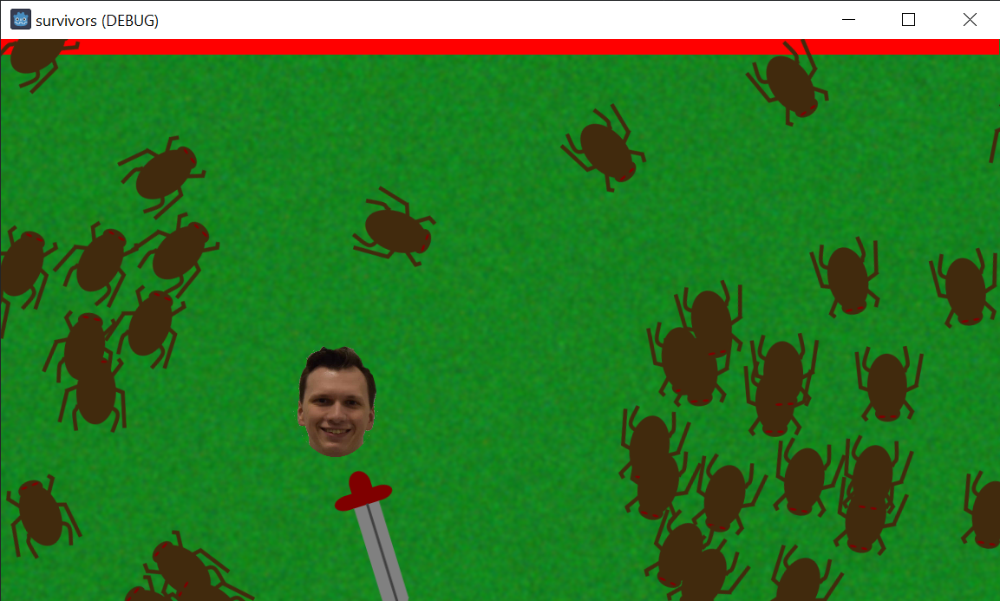

# **Godot**

Slides voor Godot workshop van het IT-lab

---

# Waarom [Godot](https://godotengine.org/)?

(Voorlopig) heel indie vergeleken met [Unity](https://unity.com/) en [Unreal](https://www.unrealengine.com/)
- Open source!
- Meer dan krachtig genoeg!
- Lijkt goed op werkwijze Unity

Jaarlijkse [showcase](https://godotengine.org/showcase/) van Godot games


---

# Vandaag: Vampire Survivors
(Maar slechter, we hebben maar 2 uur...)

[](http://www.youtube.com/watch?v=bzYEU3rBD-Y "Vampire Survivors Gameplay")

---

# Slides en project
- Het project in `godot/survivors` gaan we vandaag stap voor stap opbouwen
- Voor wie niet gewoon is met git te werken: je kan ook downloaden als zip
- Om te volgen heb je enkel de 4 png-afbeeldingen in `resources` nodig


---

# Maak een nieuw Godot-project



---

# Godot hoofdscherm



---

- Linksonder: File system: hoe het er uit ziet op de harde schijf
- Linksboven: Objectstructuur: boom van objecten
    - Meeste code gaat aan één van deze objecten hangen
    - 1 boom per Scene
- Scenes: losse objectbomen
    - Nog geen zorgen maken, we gaan daar een voorbeeld van hebben!
- Rechts: objectproperties
    - Bijvoorbeeld: Grootte van de menuknop
- Bovenaan: editors (voor ons vandaag 2d en script)
- Rechtsboven: play alles, of play deze Scene

---

# Project klaarstellen
- 2d view (Sorry!)
- Root node
    - Voorlopig houden we alles in 1 boom
    - Root node leeg object: "Node"
- 2 subnodes: Game (Node2D) en Menu (Control)
    - Game onzichtbaar
    - Menu krijgt een knop

---

# Achtergrond toevoegen
- Kan (oa) met 2D sprite
- Resourcemapje plakken in project
- grass.png slepen naar veld
- In objectbrowser: sprite onder game
- Game mag weer zichtbaar, om makkelijk te werken

---

# Scripts
- GDScript -> lijkt op Python
    - C# ook mogelijk
- Script regelt gedrag van componenten
- In root node: 
    - Functie die `game_start()` (doet niets, voorlopig)
    - Functie die `game_over()`t (doet ook niets)
        - Zal later menu klaarzetten en game opruimen
    - Setup: `_ready()` functie: `game_over()`
    - _process elk frame, hier niet nodig

---

# Signalen
- Dit is hoe nodes communiceren
- Signaal van knop moet naar root script gaan
- Node tab rechts
- Signaal verbinden



---



---

# Signaal van root node: Custom signaal

```
extends Node # staat er al

signal startGame
signal gameOver
```
```
func start_game():
	startGame.emit()

func game_over():
	gameOver.emit()
```

---

- Custom signalen verschijnen nu in signaalbalk
- Signalen verbinden met methodes in Game en Menu



---

# Reminder om eens te testen

---

# Character2D

- Characters die scriptmatig bewegen
- Op floating instellen
- Sprite en CollisionShape2D
    - Reageren op monster!



---

# Script aanpassen
- Standaard script is platformer
```
var leftright = Input.get_axis("ui_left", "ui_right")
if leftright:
	velocity.x = leftright * SPEED
else:
	velocity.x = 0
var updown = Input.get_axis("ui_up", "ui_down")
if updown:
	velocity.y = updown * SPEED
else:
	velocity.y = 0
velocity = SPEED * velocity.normalized()
var collision_info = move_and_collide(velocity * delta)
```
---

# Sword node
- Onder hero, beweegt mee!
- Ook character2D
- CollisionPolygon2D
- Sprite2D
- Sprite en poly weg van middelpunt!
    - Draaien rond midden


---

# Wapen script

```
func _process(delta):
	rotate(BASE_ROT_SPEED * level * delta)
```

- Wapen draait rond held
- Uitbreiding: wapen blinkt aan en uit
    - In voorbeeldproject
    - Als we tijd hebben

---

# Healthbar

- Type: ColorRect
- Zend `gameOver` signaal bij 0 leven, verbonden met root node
- Verandert `scale` bij schade
```
func health_changed(damage):
	health -= damage
	scale.x = (health/100)
	if health < 0:
		gameOver.emit()

func start_game():
	health = 100
	scale.x = 1
```

---

# Enemy
- Boom die verschillende keren voorkomt
    - Nieuwe scene!
- Root node: character2D (uiteraard)
    - Subnodes: sprite2D en Collisionshape2D
- Zal in de boom van de andere scene komen
    - We kunnen dus nodes van daar opzoeken
```
@onready
var hero = get_node('../Hero')
```

---

# Signaal met parameter

```
signal dealDamage(amount)
```

- Beweging:
    - Kijk en beweeg naar de hero
      (Mijn png is verkeerd gedraaid, sorry!)

```
look_at(hero.transform.origin)
velocity = hero.transform.origin - transform.origin
velocity = velocity.normalized()
velocity *= SPEED
```
---

# Colliders

- Een collider zit op een layer
- We kunnen layers namen geven
- Met masks kiezen we welke andere zaken deze collider triggeren



---

- Collider op hero: laag 1, geen mask
- Collider op sword: laag 3, geen mask
- Collider op enemy: laag 2
    - mask op laag 1 en 3
    - enemy verantwoordelijk voor zelf sterven
    - enemy kent zijn eigen DPS

```
var collision_info = move_and_collide(velocity * delta)
if collision_info:
	if collision_info.get_collider() == hero:
		dealDamage.emit(delta * DPS)
	else:
		queue_free()
```

---

- Vijanden spawnen in game script
- Gamescript moet enemy scene kennen
- Export: in editor attributen instellen

```
@export var enemyScene : PackedScene
```



---
- Aantal zaken instellen voor straks:
```
@onready
var hero = get_node("Hero")
@onready
var heroStart = hero.transform

signal heroDamaged(amount)
```

---

```
func spawn():
	var enemy = enemyScene.instantiate()
	var border = randi_range(0,3)
	var x = 0
	var y = 0
	if border == 0:
		x = randi_range(0,get_viewport().size.x)
		y = -30
	elif border == 1:
		x = get_viewport().size.x + 30
		y = randi_range(0,get_viewport().size.y)
	elif border == 2:
		x = randi_range(0,get_viewport().size.x)
		y = get_viewport().size.y + 30
	else:
		x = -30
		y = randi_range(0,get_viewport().size.y)
	enemy.position = Vector2(x,y)
	enemy.dealDamage.connect(hero_damaged)
	add_child(enemy)
```
---

# Timers
- Timer als component
```
@onready
var timer = get_node("Timer")
```
```
func start_game():
	visible = true
	hero.transform = heroStart
	timer.start(0.2)
	spawn()
	spawn()
	spawn()
```

---

```
func game_over():
	visible = false
	timer.stop()
```

---

